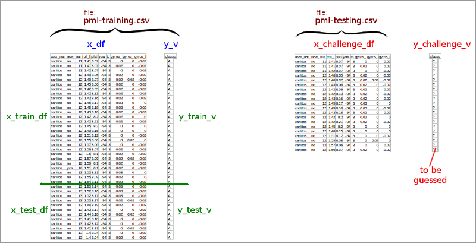

```{r echo=F,results='hide',warning=F,message=F } 
# load the libraries
library(randomForest)
library(caret)
``` 

# Introduction

_Assignment_ : this project is about making predictions about what type of physical action was undertaken by a person being monitored by an activity monitoring device (eg. fitbit, fuelband, ...). The person(s) in question were asked to lift barbells correctly and incorrectly in 5 different ways. Depending on the data gathered by the monitoring device, a prediction should be made which action was undertaken. 

More information about the project and where the data comes from: [groupware.les.inf.puc-rio.br/har](http://groupware.les.inf.puc-rio.br/har) (Weight Lifting Exercise Dataset). 


## Strategy 

Outline of how to tackle the problem:

- check the given data, see which columns make most chance of providing a correct response and subset accordingly 

- clean/convert the data 

- split the data into training and testing data 

- apply the model on the training data and testing data.  

- judge from the training and testing error if the prediction is close enough, otherwise start over

- finally apply the model on the challenge, and get the requested prediction 

The chosen method is "randomForest", because it is one of the best performing algorithms. 

Given are two files:
    - pml-training.csv : the predictors plus the outcome, to train a model to. To be split into train and test (validate).
    - pml-testing.csv : the predictors but without the outcome, that is what needs to be predicted. Ie. this is the challenge data.

Overview: how the data from the given files is reorganized into dataframes and vectors:



Note: the above diagram may give the impression that the split into training and test data occurs at a fixed position, but in fact the elements are chosen randomly.


# Step 1: clean and subset the data 

## Training data

In this step we create a dataframe called `meta` which provides information about the given training data, to be used as basis for judging which columns to include.

```{r}
raw_df <- read.table("pml-training.csv" , sep=",", head=T, as.is=T, na.strings="NA",
                     quote='"',stringsAsFactors=T )

nc <- ncol(raw_df)
nr <- nrow(raw_df)

# loop over each column, gather some statistics
vn <- character(nc)
nac <- numeric(nc)
divc <- numeric(nc)
blnk <- numeric(nc)
for (i in 1:nc) { 
    vn[i]   <- names(raw_df)[i]
    nac[i]  <- round(100*length(which(is.na(raw_df[,i])))/nr,0)
    divc[i] <- 0
    blnk[i] <- 0
    if (class(raw_df[,i])=="character") {  # count the DIV/0's and the blanks
        divc[i]= round(100*length(which(raw_df[,i]=="#DIV/0!"))/nr,0)
        blnk[i]= round(100*length(which(raw_df[,i]==""))/nr,0)
    }
} 
meta <- data.frame(vn,nac,divc,blnk)
meta$tot=meta$nac+meta$divc+meta$blnk
# manually selected columns to be dropped
meta[meta$vn %in% c("X","raw_timestamp_part_1", "raw_timestamp_part_2", "cvtd_timestamp","classe"),"tot"]=100
```
The above dataframe counts :

- how many NA's occur in a column
- how often the label "#DIV/5!" occurs in a column (which prevented the auto-conversion of the column to numeric)
- how often the text is blank in a column

These counts are not expressed in absolute numbers, but in percentages, to make it easier to compare.

A number of columns were manually selected to be excluded (eg. "raw_timestamp_part_1" because of timestamp data)

The selected columns that we are continuing with, are the ones in above dataframe that have a total (column 'tot') score of less than 5. 

```{r}
selcols= as.vector(meta[meta$tot<5,"vn"])

x_df=raw_df[,selcols]            # predictors (dataframe)
y_v=as.factor(raw_df[,"classe"]) # outcome    (vector)

# column conversions to factor
x_df$user_name <- as.factor(x_df$user_name)
x_df$new_window <- as.factor(x_df$new_window)

# all the other columns -> conversions to numeric 
for (i in 3:ncol(x_df)) { 
    x_df[,i]<- as.numeric(x_df[,i])
}
```


## Challenge data

To the challenge data we apply exactly the same subsetting/cleaning that was done on the training data.

```{r}
raw_df <- read.table("pml-testing.csv" , sep=",", head=T, as.is=T, na.strings="NA",
                     quote='"',stringsAsFactors=T )

xchallenge_df=raw_df[,selcols]  # restrict to only the selected columns 

# for the factor conversions use the same levels as the training data
xchallenge_df$user_name=factor( xchallenge_df$user_name, levels(x_df$user_name ) )  
xchallenge_df$new_window=factor( xchallenge_df$new_window, levels(x_df$new_window) )  

# all the other columns -> convert to numeric 
for (i in 3:ncol(xchallenge_df)) { 
    xchallenge_df[,i]<- as.numeric(xchallenge_df[,i])
}
```

## Summary of step 1 

We've cleaned the data, and reduced the number of columns to a subset. 

We'll proceed to the next step with these objects:

- `x_df` : the variables (in a dataframe) to fit the model on 
- `y_v` : the outcome data in a vector (ie. the 'classe' column of the original dataset)
- `x_challenge_df`: the variables we have to make a prediction for


# Step 2 : fit a model 

## Split the training data into training and test 

Randomly split the dataset into a training set and test set, in a 75% ratio. 

- the training set will be used to fit the model 
- the test set will be used to validate the model

Training set: 
```{r}
nr=nrow(x_df)
train=sample(1:nr,nr*.75)
xtrain_df=x_df[train,]
ytrain_v=y_v[train]
```

Test set: 
```{r}
xtest_df=x_df[-train,] 
ytest_v=y_v[-train]
```

## Fit a randomforest to the training data

This is the most time-consuming step of the whole process: fitting a random forest. 

```{r}
fit=randomForest(xtrain_df,ytrain_v) 

summary(fit)
```

## Training result prediction 

Make a prediction on the training data, to judge the correctness of the data.

```{r}
ytrain_pred_v <- predict(fit,xtrain_df) 

numtrue= sum(ytrain_v==ytrain_pred_v) 
percentcorrect= round(100*numtrue/length(ytrain_v),2)
```
The percent correctly predicted outcomes, when applied to the training data is **`r percentcorrect`%**. 

**Confusion Matrix:**
```{r}
confusionMatrix( ytrain_v, ytrain_pred_v )$table
```

## Test result prediction 

```{r}
ytest_pred_v <- predict(fit,xtest_df) 

numtrue= sum(ytest_v==ytest_pred_v) 
percentcorrect= round(100*numtrue/length(ytest_v),2)
```
The percent correctly predicted outcomes, when applied to the testing data is **`r percentcorrect`%**. 
Which means that the out-of-sample error is  **`r 100-percentcorrect`%**. 


**Confusion Matrix:**
```{r}
confusionMatrix( ytest_v, ytest_pred_v )$table
```

Conclusion: this out of sample error is very close to 0, which makes this is a more-than-acceptable fit. No further tweaks need to be applied to the model, we are happy to proceed to next step: predicting the challenge. 


# Step 3: predict the challenge

This is the ultimate goal of the project, predict the `classe` outcome for the challenge data contained in the file `pml-testing.csv`. 

```{r}
ychallenge_pred_v <- predict(fit,xchallenge_df) 
ychallenge_pred_v 
```

This result was submitted to the MOOC's Coursera website for judgement. And it turned out to be 100% correct! 


